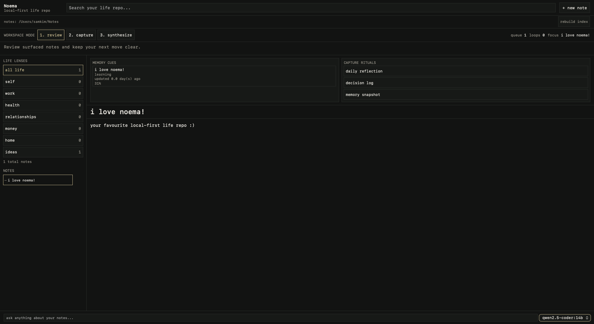

# Noema

Local-first life repo for searching and chatting with your notes. **v0**.

## Use flow

1. `npm install` then `npm run tauri dev`
2. Choose your notes folder when prompted; click **rebuild index**
3. Write notes, use search, ask questions in chat and open sources with `[1]`, `[2]`, etc.

## Daily use

Add or edit notes, rebuild index when needed, ask questions and follow source links.

## Troubleshooting

- No results → **rebuild index**
- AI errors → ensure Ollama is running
- Wrong folder → restart and set the notes folder again
